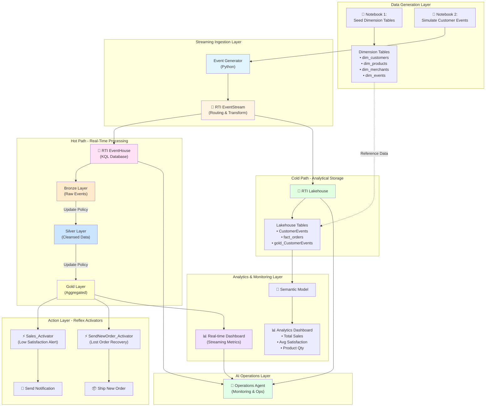
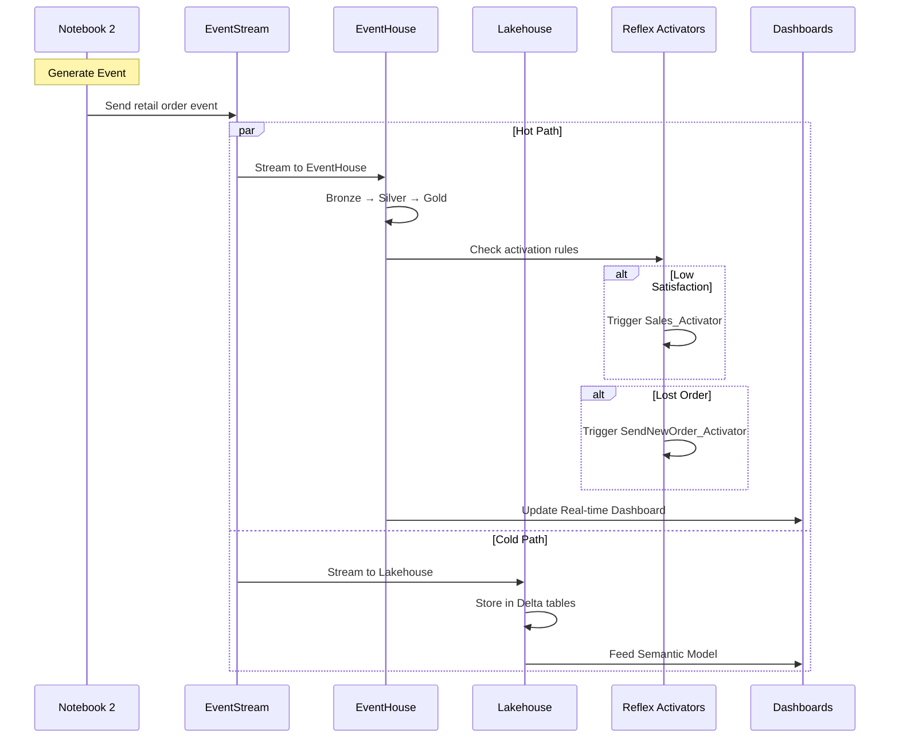

# RTI Demo - Detailed Architecture Documentation

This document provides comprehensive architecture diagrams and component details for the RTI Demo solution.

---

## End-to-End Data Flow Architecture

---

## Data Flow Sequence Diagram

---

## Component Details

### 1️⃣ Data Generation Layer
- **Notebook 1: Seed Dimension Tables**
  - Creates reference/dimension tables
  - Tables: `dim_customers`, `dim_products`, `dim_merchants`, `dim_events`
  - One-time setup for master data

- **Notebook 2: Simulate Customer Events**
  - Generates realistic retail order events
  - Simulates customer behavior patterns
  - Configurable event rate and volume

### 2️⃣ Streaming Ingestion Layer
- **RTI EventStream**
  - Captures events in real-time
  - Routes to multiple destinations (hot & cold paths)
  - Performs light transformations
  - Schema validation

### 3️⃣ Hot Path - EventHouse (Real-Time)
- **RTI EventHouse (KQL Database)**
  - Ultra-low latency ingestion
  - KQL query capabilities
  - Update policies for data transformation
  
- **Medallion Architecture:**
  - **Bronze Layer**: Raw event ingestion (high velocity)
  - **Silver Layer**: Cleansed, validated data
  - **Gold Layer**: Business-level aggregations

### 4️⃣ Cold Path - Lakehouse (Analytics)
- **RTI Lakehouse**
  - Parquet/Delta format for analytics
  - Integration with dimension tables
  - Tables: `CustomerEvents`, `fact_orders`, `gold_CustomerEvents`
  - Optimized for complex queries and ML

### 5️⃣ Action Layer - Reflex Activators
- **Sales_Activator**
  - Trigger: Customer satisfaction score < threshold
  - Action: Send alert/notification to sales team
  
- **SendNewOrder_Activator**
  - Trigger: Order status = "lost"
  - Action: Automatically ship replacement order

### 6️⃣ Analytics & Monitoring
- **Real-time Dashboard**
  - Live streaming metrics
  - Event throughput monitoring
  - System health indicators
  
- **Semantic Model & Analytics Dashboard**
  - Total sales amount
  - Average customer satisfaction score
  - Product quantity metrics
  - Trend analysis

### 7️⃣ AI Operations
- **Operations Agent**
  - AI-powered monitoring
  - Automated troubleshooting
  - Proactive recommendations

---

## Technology Stack

| Layer | Technology | Purpose |
|-------|-----------|---------|
| **Event Generation** | PySpark, Python | Simulate retail events |
| **Ingestion** | Fabric EventStream | Real-time event routing |
| **Hot Storage** | Fabric EventHouse (KQL) | Low-latency queries |
| **Cold Storage** | Fabric Lakehouse (Delta) | Analytical workloads |
| **Transformation** | KQL Update Policies | Bronze → Silver → Gold |
| **Actions** | Fabric Reflex | Event-driven automation |
| **Visualization** | Power BI, Real-time Dash | Analytics & monitoring |
| **AI/ML** | Operations Agent | Intelligent operations |

---

## Key Features

✅ **Real-time Processing**: Sub-second latency from event to insight  
✅ **Lambda Architecture**: Hot path (EventHouse) + Cold path (Lakehouse)  
✅ **Medallion Design**: Bronze → Silver → Gold data quality layers  
✅ **Event-Driven Actions**: Automated responses via Reflex  
✅ **Scalability**: Handles high-velocity streaming data  
✅ **AI-Powered Ops**: Intelligent monitoring and troubleshooting  
✅ **End-to-End Observability**: Dashboards at every layer

---

## Design Patterns

### Lambda Architecture
The solution implements Lambda Architecture with:
- **Hot Path (Speed Layer)**: EventHouse for real-time analytics
- **Cold Path (Batch Layer)**: Lakehouse for comprehensive analysis
- **Serving Layer**: Dashboards and semantic models

### Medallion Architecture
Data quality improves through layers:
- **Bronze**: Raw, unprocessed data from event sources
- **Silver**: Validated, cleansed, and deduplicated data
- **Gold**: Business-level aggregated and enriched data

### Event-Driven Architecture
- Events trigger automated actions via Reflex
- Decoupled components communicate through EventStream
- Asynchronous processing for scalability

---

**Architecture Version**: 1.0  
**Last Updated**: March 27, 2026
