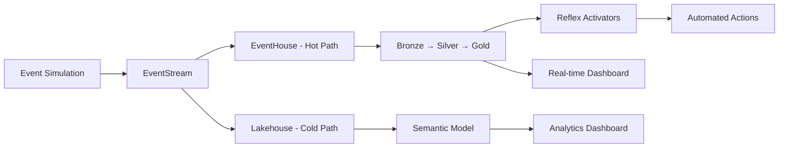

# RTI+ IQ Demo — Retail Orders Real-Time Intelligence

Demo assets for a retail orders Real-Time Intelligence (RTI) scenario in Microsoft Fabric. This solution demonstrates end-to-end streaming analytics with event ingestion, real-time processing, data curation, automated actions, and AI-powered monitoring.

**Data Flow:** Simulated retail events → Eventstream → Eventhouse → Lakehouse → Reflex Triggers → Dashboards

---

## Table of Contents
- [Overview](#overview)
- [Architecture](#architecture)
- [Features](#features)
- [What's in this Repo](#whats-in-this-repo)
- [Prerequisites](#prerequisites)
- [Quick Start](#quick-start)
- [Technology Stack](#technology-stack)
- [Troubleshooting](#troubleshooting)
- [Learning Resources](#learning-resources)
- [Contributing](#contributing)

---

## Overview

This repository contains a complete **Real-Time Intelligence (RTI)** solution built on Microsoft Fabric for retail order analytics. The solution implements a **Lambda Architecture** with **Medallion layers** (Bronze → Silver → Gold) for handling both streaming and batch data workloads.

### What You'll Learn
- 🔄 **Streaming event ingestion** with Fabric Eventstream
- ⚡ **Real-time data processing** with Eventhouse (KQL)
- 🏗️ **Data curation** in Lakehouse with medallion architecture
- 🎯 **Automated actions** with Reflex (Data Activators)
- 📊 **Real-time monitoring** dashboards
- 🤖 **AI-powered operational** agents

### Business Use Case
Monitor retail orders in real-time, detect issues (low customer satisfaction, lost orders), and automatically trigger corrective actions while maintaining a comprehensive analytics layer for business insights.

---

## Architecture

### End-to-End Data Flow



### Architecture Layers

1. **Data Generation Layer**: Notebooks simulate retail events and seed dimension tables
2. **Ingestion Layer**: Eventstream routes and transforms events in real-time
3. **Hot Path**: Eventhouse provides sub-second query performance with KQL
4. **Cold Path**: Lakehouse stores curated data for analytical workloads
5. **Transformation**: Update policies move data through Bronze → Silver → Gold
6. **Action Layer**: Reflex activators trigger business actions
7. **Analytics**: Real-time and semantic dashboards for insights
8. **AI Operations**: Operations agent for monitoring and troubleshooting

📐 **[View Detailed Architecture Diagram](./Architecture.md)**

---

## Features

✅ **Real-time Processing**: Sub-second latency from event to insight  
✅ **Lambda Architecture**: Hot path (EventHouse) + Cold path (Lakehouse)  
✅ **Medallion Design**: Bronze → Silver → Gold data quality layers  
✅ **Event-Driven Actions**: Automated responses via Reflex  
✅ **Scalability**: Handles high-velocity streaming data  
✅ **AI-Powered Operations**: Intelligent monitoring and troubleshooting  
✅ **End-to-End Observability**: Dashboards at every layer  

---

## What's in this Repo

### 📓 Notebooks
| Notebook | Purpose | Key Outputs |
|----------|---------|-------------|
| **1. Seed Dimension Tables** | Initializes reference data | `dim_customers`, `dim_products`, `dim_merchants`, `dim_events` |
| **2. Simulate Real-time Customer Events** | Generates streaming retail events | Real-time order and customer activity data |

### 🏢 Data Infrastructure
- **RTIDemoLakehouse** - Lakehouse for analytical storage
  - Bronze Layer: Raw event ingestion
  - Silver Layer: Cleansed and validated data
  - Gold Layer: Aggregated business metrics
  - Tables: `CustomerEvents`, `fact_orders`, `gold_CustomerEvents`

- **RTIDemoEventHouse** - Eventhouse for real-time querying
  - KQL database for low-latency analytics
  - Update policies for data transformation
  - Bronze → Silver → Gold layers

### 🔄 Streaming Components
- **RTIDemoEventStream** - Routes and transforms events from sources to destinations
- **QueryForUpdatePolicy.KQL** - Defines transformation logic for medallion layers

### 📊 Analytics & Monitoring
- **Real-time Dashboard** - Monitors streaming status, throughput, and system health
- **Semantic Model** - Powers analytics dashboards with metrics:
  - Total sales amount
  - Average customer satisfaction score
  - Product quantity analysis
  - Trend analysis

### ⚡ Reflex Activators
| Activator | Trigger Condition | Action |
|-----------|-------------------|--------|
| **Sales_Activator** | Customer satisfaction score < threshold | Send notification to sales team |
| **SendNewOrderActivator** | Order status = "lost" | Automatically ship replacement order |

### 🤖 AI Operations
- **rtioperationagent.OperationsAgent** - AI-powered monitoring, troubleshooting, and recommendations

---

## Prerequisites

### Required Access
- ✅ Microsoft Fabric workspace with **Real-Time Intelligence** features enabled
- ✅ **Contributor** or **Admin** permissions in the workspace

### Component Permissions
You need permission to create/import:
- Notebooks
- Eventstreams
- Eventhouses
- Lakehouses
- Reflex (Data Activators)
- Semantic Models
- Real-Time Dashboards

### Recommended Knowledge
- Basic understanding of streaming data concepts
- Familiarity with KQL (Kusto Query Language) - helpful but not required
- PySpark basics for notebook customization

---

## Quick Start

⏱️ **Total setup time: ~30-45 minutes**

### Step 1: Import Repository (5 min)
```bash
# Clone or download this repository
# Import into your Fabric workspace
```

### Step 2: Configure Infrastructure (5 min)
1. Create or select your target **Lakehouse** (RTIDemoLakehouse)
2. Create or select your target **Eventhouse** (RTIDemoEventHouse)
3. Update any binding references if items were renamed

**✅ Verify**: Check that both lakehouse and eventhouse appear in your workspace

### Step 3: Seed Initial Data (5 min)
1. Open **Notebook 1: Seed Dimension Tables**
2. Attach the notebook to RTIDemoLakehouse
3. Run all cells
4. Wait for completion (~2-3 minutes)

**✅ Verify**: Check that dimension tables appear in Lakehouse:
- `dim_customers`
- `dim_products`
- `dim_merchants`
- `dim_events`

### Step 4: Configure Streaming (10 min)
1. Open **RTIDemoEventStream**
2. Configure source connection
3. Connect to Eventhouse and Lakehouse destinations
4. Validate transformations
5. Start the Eventstream

**✅ Verify**: Eventstream shows "Running" status

### Step 5: Create Update Policies (5 min)
1. Open **QueryForUpdatePolicy.KQL** queryset
2. Execute queries to create Bronze → Silver → Gold transformation policies
3. Verify policies are active in Eventhouse

**✅ Verify**: Update policies appear in Eventhouse settings

### Step 6: Start Event Generation (5 min)
1. Open **Notebook 2: Simulate Real-time Customer Events**
2. Attach to RTIDemoLakehouse
3. Configure event generation parameters (rate, volume)
4. Run the notebook

**✅ Verify**: 
- Events start appearing in Eventhouse (check query results)
- Eventstream shows increasing event count

### Step 7: Validate Data Pipeline (5 min)
**Check Eventhouse:**
```kql
// Query to verify event ingestion
CustomerEvents
| take 10
```

**Check Lakehouse:**
- Browse to Tables → `CustomerEvents`, `fact_orders`
- Verify data is populating

**✅ Verify**: Data flows through all layers (Bronze → Silver → Gold)

### Step 8: Enable Activators (5 min)
1. Open **sales_activator**
   - Configure satisfaction score threshold
   - Set notification recipients
   - Activate

2. Open **SendNewOrderActivator**
   - Configure lost order detection
   - Set action parameters
   - Activate

**✅ Verify**: Both activators show "Active" status

### Step 9: Create Operational Agent (5 min)
1. Set up **rtioperationagent** Operations Agent
2. Configure monitoring parameters
3. Test agent functionality with sample queries

**✅ Verify**: Agent responds to operational queries

### Step 10: View Dashboards (Optional)
1. Open **Real-time Dashboard** to monitor streaming metrics
2. Create or open **Semantic Model** visualizations
3. Configure refresh schedules

**✅ Verify**: Dashboards display current data

---

## Technology Stack

| Layer | Technology | Purpose |
|-------|-----------|---------|
| **Event Generation** | PySpark, Python | Simulate retail events |
| **Ingestion** | Fabric EventStream | Real-time event routing |
| **Hot Storage** | Fabric EventHouse (KQL) | Low-latency queries |
| **Cold Storage** | Fabric Lakehouse (Delta/Parquet) | Analytical workloads |
| **Transformation** | KQL Update Policies | Bronze → Silver → Gold |
| **Actions** | Fabric Reflex | Event-driven automation |
| **Visualization** | Power BI, Real-time Dashboards | Analytics & monitoring |
| **AI/ML** | Operations Agent | Intelligent operations |

---

## Troubleshooting

### Events Not Appearing in Eventhouse
- ✔️ Verify Eventstream is in "Running" state
- ✔️ Check event source connection settings
- ✔️ Review Eventstream diagnostics logs
- ✔️ Ensure Eventhouse destination is properly configured

### Notebook Execution Errors
- ✔️ Ensure Lakehouse is properly attached to notebook
- ✔️ Verify you have write permissions to the Lakehouse
- ✔️ Check that dimension tables were created in Step 3
- ✔️ Confirm all required libraries are installed

### Activators Not Triggering
- ✔️ Confirm activators are in "Active" state
- ✔️ Verify threshold conditions are met in your data
- ✔️ Check Reflex logs for error messages
- ✔️ Review activator query logic

### Data Not Moving Between Layers
- ✔️ Verify update policies are correctly configured
- ✔️ Check KQL query syntax in update policy definitions
- ✔️ Ensure source and target tables exist in Eventhouse
- ✔️ Review update policy execution logs

### Performance Issues
- ✔️ Monitor event generation rate (reduce if needed)
- ✔️ Check Eventhouse query performance
- ✔️ Review Lakehouse table optimization
- ✔️ Consider scaling compute resources

### General Tips
- 💡 Use the Operations Agent for automated troubleshooting
- 💡 Check workspace activity logs for detailed error messages
- 💡 Ensure all items are in the same workspace for proper connectivity
- 💡 Review Microsoft Fabric service health status

---

## Project Structure

```
RTI Demo/
├── Notebooks/
│   ├── 1. Seed Dimension Tables/
│   │   ├── 1. Seed Dimension Tables.ipynb
│   │   ├── builtin/
│   │   └── dependencies/
│   │
│   ├── 2. Simulate Real-time Customer Events/
│   │   ├── 2. Simulate Real-time Customer Events.ipynb
│   │   ├── builtin/
│   │   └── dependencies/
│   │
│   └── CreateDashboard/
│       └── CreateDashboard.ipynb (Architecture Documentation)
│
├── Lakehouses/
│   └── RTIDemoLakehouse/
│       ├── Files/
│       └── Tables/
│           └── dbo/
│               ├── CustomerEvents
│               ├── dim_customers
│               ├── dim_products
│               ├── dim_merchants
│               ├── dim_events
│               ├── fact_orders
│               └── gold_CustomerEvents
│
├── Environments/
├── README.md (this file)
└── Architecture.md (detailed diagrams)
```

**Note**: Folders with extensions (`.Notebook`, `.Eventhouse`, `.Eventstream`, `.Lakehouse`, `.Reflex`, `.OperationsAgent`) represent Fabric item export formats.

---

## Learning Resources

### Microsoft Fabric Documentation
- [Real-Time Intelligence Overview](https://learn.microsoft.com/fabric/real-time-intelligence/)
- [Eventhouse Documentation](https://learn.microsoft.com/fabric/real-time-intelligence/eventhouse)
- [Eventstream Guide](https://learn.microsoft.com/fabric/real-time-intelligence/event-streams/overview)
- [Data Activator (Reflex)](https://learn.microsoft.com/fabric/data-activator/)
- [KQL Query Language Reference](https://learn.microsoft.com/kusto/query/)
- [Fabric Lakehouse](https://learn.microsoft.com/fabric/data-engineering/lakehouse-overview)

### Tutorials & Samples
- [Real-Time Intelligence Tutorial](https://learn.microsoft.com/fabric/real-time-intelligence/tutorial-introduction)
- [Streaming Analytics Patterns](https://learn.microsoft.com/fabric/real-time-intelligence/event-streams/stream-real-time-events-from-custom-app-to-kusto)
- [Medallion Architecture Best Practices](https://learn.microsoft.com/azure/databricks/lakehouse/medallion)

---

## Contributing

We welcome contributions! Here's how you can help:

### How to Contribute
1. Fork this repository
2. Create a feature branch (`git checkout -b feature/improvement`)
3. Commit your changes (`git commit -am 'Add new feature'`)
4. Push to the branch (`git push origin feature/improvement`)
5. Create a Pull Request

### What to Contribute
- 🐛 Bug fixes and error corrections
- 📝 Documentation improvements
- 🎯 Additional use case scenarios
- ⚡ Performance optimizations
- 📊 New dashboard templates
- 🧪 Test scenarios and validation scripts

### Code Style
- Follow PySpark best practices for notebooks
- Use clear, descriptive variable names
- Add comments for complex logic
- Include error handling

### Questions or Issues?
- Open an [issue](../../issues) for bugs or feature requests
- Tag issues with appropriate labels (bug, enhancement, documentation)
- Provide detailed reproduction steps for bugs

---

## Notes

### After Importing to Fabric
- If you rename items in Fabric workspace, update all references in:
  - Notebook connection strings
  - Eventstream destinations
  - KQL queries and update policies
  - Activator source configurations

### Best Practices
- 🔒 Keep all components in the same workspace for simplified connectivity
- 📛 Use descriptive names when cloning items
- ✅ Test each step before proceeding to the next
- 💾 Save intermediate results for validation
- 📊 Monitor resource usage and costs

---

## License

[Specify your license here - e.g., MIT, Apache 2.0, etc.]

---

## Support

For questions, issues, or suggestions:
- 📧 Email: [your-email@example.com]
- 💬 Teams: [your-teams-channel]
- 🐛 Issues: [GitHub Issues](../../issues)

---

**Built with ❤️ using Microsoft Fabric**

*Last updated: March 27, 2026*
